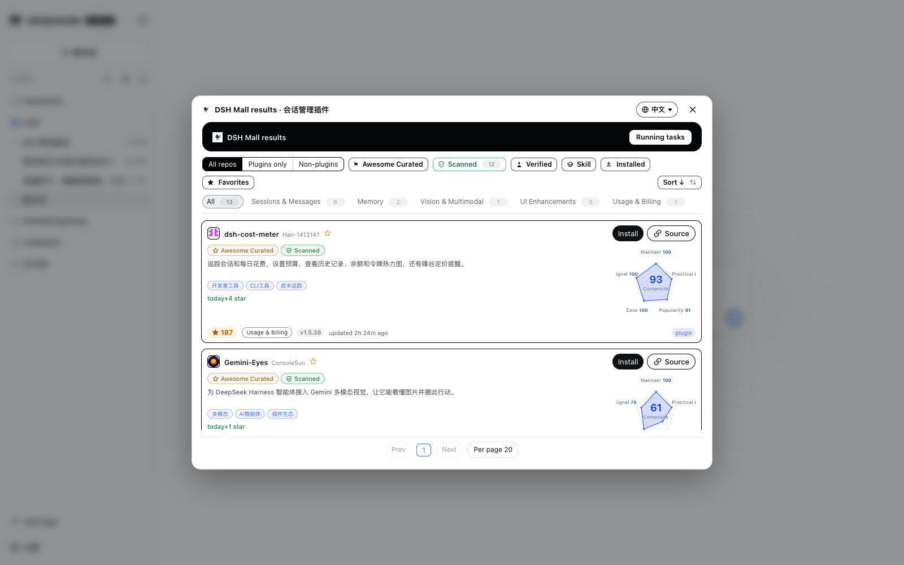
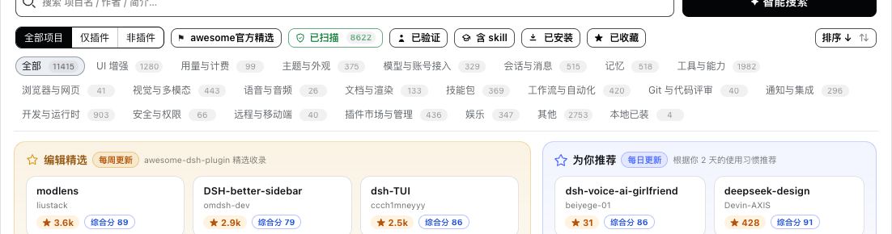
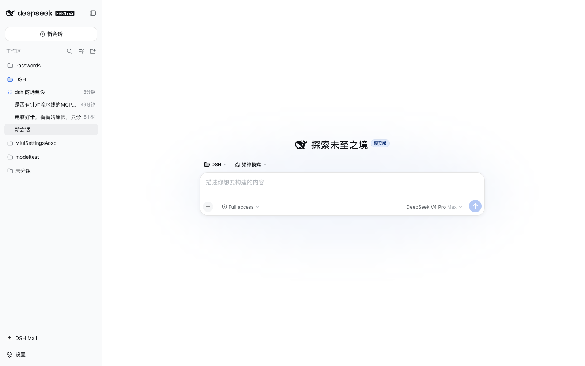

# DSH Mall

All the `#dsh-plugin` repos on GitHub, in one mall: browse, search, compare scores, one-click install. Before installing you can also let AI read the code first and veto it if it looks off.

[**中文**](README.md) · [Releases](https://github.com/hoyyang/dsh-mall/releases) · [Changelog](CHANGELOG.md)

<p align="center">
  
  
  
  
  
</p>


## Install

```sh
dsh plugin add dsh-mall
```

Restart `dsh web` and **DSH Mall** shows up in the sidebar above Settings. Requires dsh web 0.1.0-rc.8 or newer (tested on 0.1.0-rc.8).

## What it does

- **Complete catalog** — every GitHub repo tagged `#dsh-plugin`, indexed by our own CI every 2 hours. No rate limits to worry about.
- **Smart install / update / uninstall** — before installing, AI (your configured model) reads the repo and returns install / caution / refuse. Uninstall scans local dependents first. Falls back to the regular flow when AI is unavailable.
- **Agent-friendly** — ships the `find_dsh_mall_plugin` tool and a skill: ask for a plugin in the conversation and it picks for you.
- **Five-dimension score** — maintain, practical, popularity, ease, signal plus one composite. Hover the radar and it explains how each number is computed.
- **Chinese tags + 9-language descriptions** — function tags in Chinese, one-line descriptions in nine languages, distributed through the index pipeline at zero per-user LLM cost.
- **Editor picks + For You** — weekly picks; recommendations based on what you installed (with a 30-second cold-start quiz).
- **Trust badges** — scanned (dsh.bundle verified by machine), curated, verified, has-skill, stale warnings. Glance and know.
- **9-language UI** — 中文, English, 日本語, 한국어, Español, Français, Deutsch, Português, Русский. One click switches everything.
- **Full lifecycle** — one-click update, daily auto-update (03:30), rollback, enable switch, task panel with progress and cancel.
- **Safe README rendering** — sanitized markdown, badge residue cleaned up, install commands extracted for copy.
- **Signals** — today's +stars, npm downloads (30d & total), version capsules.

## Usage walkthrough

Ranked by usefulness, brightest first. (Screenshots show the Chinese UI; every screen switches to any of the nine languages in one click.)

### 🧠 Smart install — usefulness 95

Pick "Smart install" in the confirm dialog: AI reviews the repo as untrusted data (delimited, never executed) and returns install / caution / refuse. "Refuse" stops the install; if AI fails or times out, it falls back to a regular install.


### 📊 Five-dimension score — usefulness 90

A pentagon radar on every card: maintain, practical, popularity, ease, signal, plus the composite in the middle. The composite is a **weighted geometric mean** — multiplicative, so one near-zero dimension drags the whole thing down. That's why a new 0-star repo scores low honestly, and rises as stars come in. Hover the radar: it glows, zooms, and a tooltip follows your mouse explaining each number in plain words.


### 🔌 Agent-friendly — usefulness 90

Works best for agents. Say what you need; the `find_dsh_mall_plugin` tool ranks the whole catalog and returns recommendations plus related entries, with a button back to the store window. Smart search first has your model translate the request into search terms, then ranks by keyword + reputation + quality.



### ⭐ Editor picks + For You — usefulness 85

Two columns in the middle of the home screen: Editor picks (refreshed every Monday, top composite scores among the awesome-curated), and For You (based on what you used in the last 30 days plus the quiz, with reasons printed on each card). No idea what to install? The quiz takes 30 seconds.



### 🧰 Task panel + restart hint — usefulness 80

Install/update/uninstall all show progress in a global task panel with cancel. Plugins whose patch carries config or expressions only hot-mount plain inserts — when a change needs a restart, the card shows "Restart required" with a "Why not effective yet?" fold-out that explains it in one sentence. The panel is shared: tasks started from the results window are visible from the main store and vice versa.



### ⚙️ Settings — usefulness 75

"DSH Mall - Settings" in the Settings window: auto-update toggle (daily 03:30), data source, optional GitHub quota config (memory only). When GitHub is down or rate-limited, the mall falls back to a bundled snapshot and keeps working.


## Where the data comes from

Built by the companion repo [**hoyyang/dsh-market-index**](https://github.com/hoyyang/dsh-market-index): GitHub search + the curated [awesome-dsh-plugin](https://awesome-dsh-plugin.com) directory, enriched with bundle scans, npm linkage, dormant detection, README signals and LLM tags. The mall reads it over raw/jsDelivr CDN and refreshes every 30 minutes.

## Security

- Every mutating endpoint (install/uninstall/update/toggle) is same-origin only.
- Install sources are always shown first; smart install treats repo content as untrusted data.
- Credentials are never persisted; user-level data-source/token routes are removed (deployment config only).
- Third-party plugins are third-party code — judge before installing. "Scanned" means installable structure, not a security audit.

## License

[MIT](LICENSE) © hoyyang. Data from GitHub and [awesome-dsh-plugin](https://awesome-dsh-plugin.com) (MIT) under their own terms.

Ideas borrowed from [dshmarket](https://www.npmjs.com/package/dshmarket) and [dsh-market](https://github.com/2BingLing/dsh-market).
