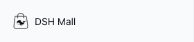
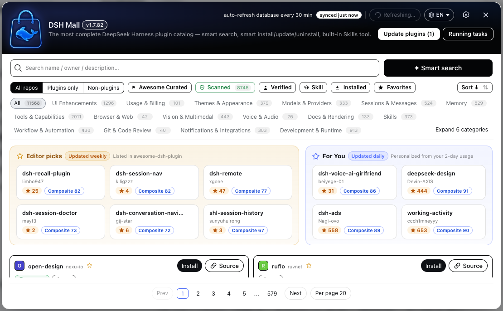
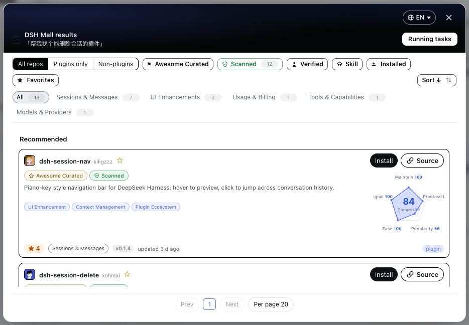
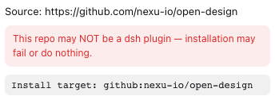
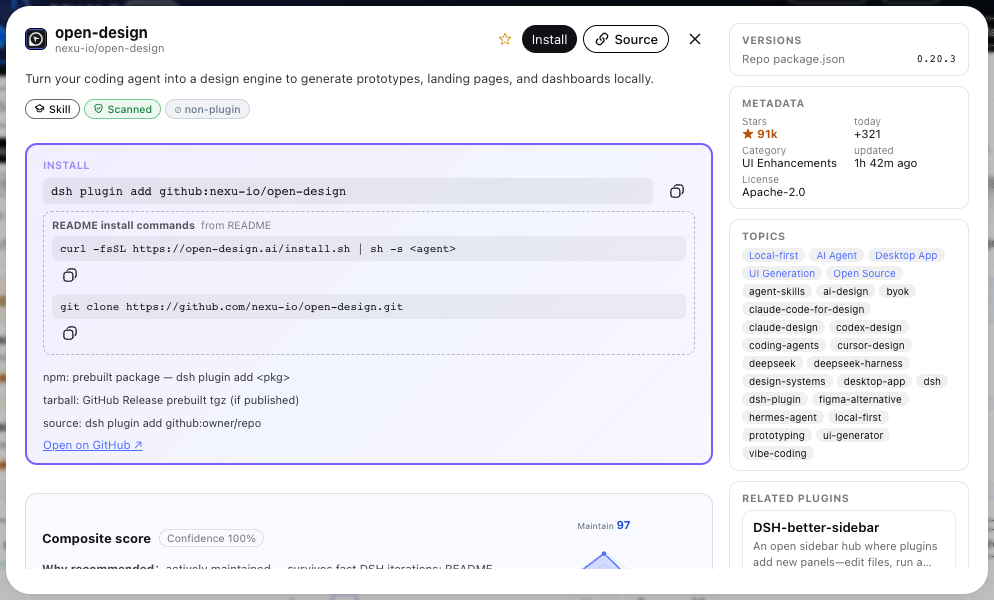
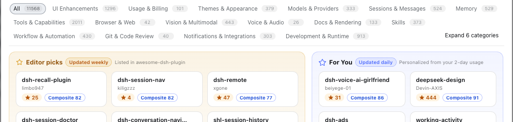
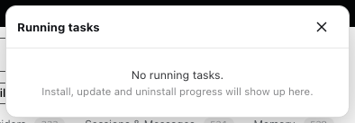
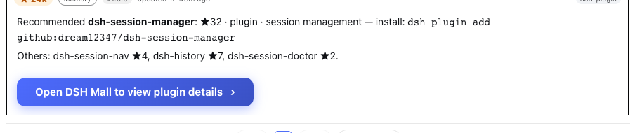
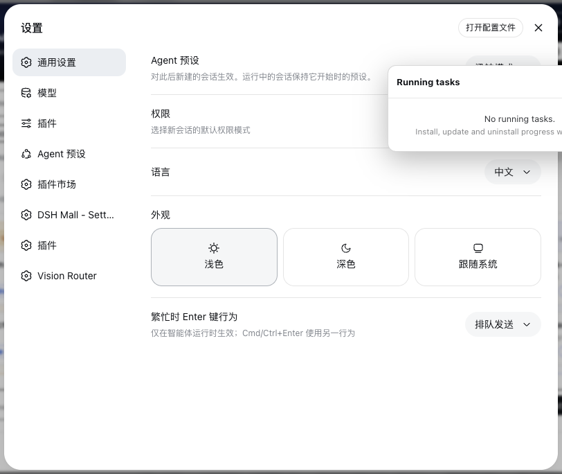

# DSH Mall


Every `#dsh-plugin` repo on GitHub, in one mall: browse, search, compare scores, install in one click. Not sure about a plugin? Let AI read its code first.

[**中文**](README.md) · [Releases](https://github.com/hoyyang/dsh-mall/releases) · [Changelog](CHANGELOG.md)

<p align="center">
  
  
  
  
  
  
</p>

## Install

```sh
dsh plugin add dsh-mall
```

Restart `dsh web` and **DSH Mall** appears in the sidebar. Requires dsh web 0.1.0-rc.8 or newer (tested on 0.1.0-rc.8).

## What's inside

- **The whole catalog** — every repo tagged `#dsh-plugin`, refreshed every 30 minutes, keeps working through rate limits.
- **AI pre-install review** — AI reads the repo first and returns install / caution / refuse. "Refuse" blocks the install.
- **Find plugins in the conversation** — the plugin ships a skill: run `/dsh-mall` in your agent session, describe what you need, and it picks for you. The reply ends with a button that opens the store window.
- **Five-dimension score** — maintain, practical, popularity, ease, signal, plus a composite. Hover the radar and it explains each number in plain words.
- **Chinese tags** — every plugin carries Chinese function tags and a one-line description in nine languages.
- **Editor picks + For You** — weekly picks; recommendations based on what you installed (30-second quiz if you have no idea).
- **Trust badges** — scanned, curated, verified, has-skill, stale warnings. Know what you're looking at.
- **9-language UI** — 中文, English, 日本語, 한국어, Español, Français, Deutsch, Português, Русский.
- **Full lifecycle** — one-click update, daily auto-update, rollback, enable switch, task panel with cancel.
- **Safe rendering** — sanitized READMEs, install commands extracted for copy.

## Usage

### 1. Where the entrance is

In the dsh home sidebar, right above **Settings**, there's **DSH Mall**. One click opens it.



### 2. What it looks like

One window is the whole mall: search and filters on top, editor picks and For You in the middle, plugin cards below. Everything happens inside this window.



### 3. Try smart search first

Next to the search box there's a "✦ Smart search" button. Type what you need in plain words — "find a plugin that can delete sessions" — it first has your model translate the request into search terms, then picks recommendations and alternatives from the whole catalog into a results window: recommendations first, cards identical to the main store, install/details/favorites all work.



Regular search, category filters, sorting, page size — all on the toolbar, ready to use.

### 4. Let AI review before installing

Pick "Smart install" in the confirm dialog: AI reviews the repo as untrusted data (never executed) and returns install / caution / refuse. "Refuse" stops the install. If AI fails or times out, it falls back to a regular install.



### 5. Look at the score, then decide

Every card has a pentagon radar with the composite in the middle. The composite is a weighted geometric mean — one near-zero dimension drags the whole thing down, so a new 0-star repo scores low honestly and rises as stars come in. Hover the radar: it glows, zooms, and a tooltip follows your mouse explaining every number. The detail panel has the full score card with "why recommended".



### 6. No idea what to install? These two columns

Middle of the home screen: "Editor picks" (a fresh six every Monday — the top composite scores from the awesome curated list) and "For You" (based on the plugins you installed recently and the quiz — recent activity counts more, hover a card to see the reasons). Still no idea? The quiz takes 30 seconds.



### 7. Every task, visible from anywhere

Install, update, uninstall all show progress in a global task panel with cancel — tasks started from the results window are visible from the main store and vice versa. Changes that need a restart get a hint on the card, with a one-sentence explanation.



### 8. Find plugins right in the conversation

The plugin ships a skill called `dsh-mall`. Run `/dsh-mall find a plugin that can delete sessions` in your agent session — it searches the whole catalog and returns recommendations plus alternatives. The last line is a button: "Open DSH Mall to view plugin details". One click lands you in the store.



### 9. Settings in one place

"DSH Mall - Settings" in the Settings window: open-the-store button, auto-update toggle (daily 03:30), the risk note, and the current version.



## License

[MIT](LICENSE) © hoyyang. Data from GitHub and [awesome-dsh-plugin](https://awesome-dsh-plugin.com) (MIT) under their own terms.
