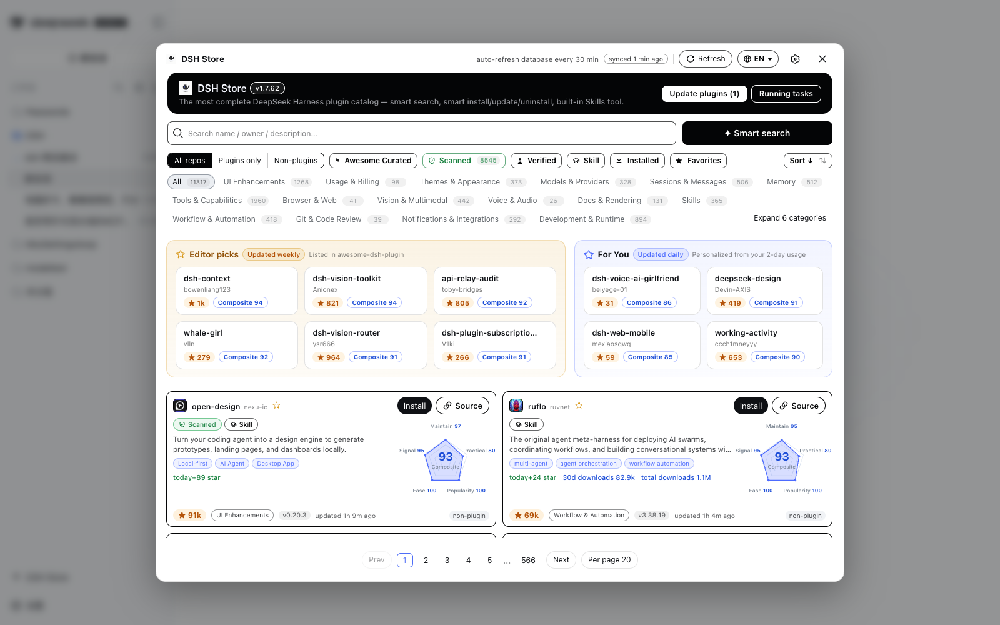

# DSH Mall

**The complete plugin mall for DeepSeek Harness** — browse the entire `#dsh-plugin` ecosystem (11,000+ repos), one-click install, AI-reviewed smart install, five-dimension practical scores, and a full UI in 9 languages.

[**中文**](README.zh.md) · [Releases](https://github.com/hoyyang/dsh-mall/releases) · [Changelog](CHANGELOG.md)

<p align="center">
  
  
  
  
</p>



---

## ✨ Features

- 🌐 **Complete catalog** — 11,000+ GitHub repos from our own CI index (incremental every 2h + daily full rebuild), served over CDN with a bundled snapshot fallback. Never rate-limited.
- 🧠 **Smart install / update / uninstall** — a pre-install AI security review (install / caution / refuse) runs through your configured model; local risk lists guard uninstalls. Falls back to the regular path when AI is unavailable.
- 📊 **Five-dimension practical score** — maintain / practical / popularity / ease / signal, weighted geometric mean × confidence, with a radar chart and "why recommended" reasons.
- 🏷️ **LLM-tagged labels & descriptions** — 11,032 plugins carry Chinese function tags and one-line descriptions in 9 languages, refreshed through the index pipeline (no per-user LLM cost).
- 🌍 **9-language UI** — English, 中文, 日本語, 한국어, Español, Français, Deutsch, Português, Русский — one click switches the entire store.
- 🛡️ **Trust badges** — machine scan (dsh.bundle verified in the repo tree), awesome curated, human verified, has-skill, stale & npm-unlinked warnings.
- ⭐ **Editor picks & For You** — weekly curated picks; profile-based recommendations with MMR diversity plus a cold-start quiz.
- ⬇️ **Signals you care about** — today's +stars, npm downloads (30d & total), publish date, version capsules.
- 🧰 **Full lifecycle management** — one-click update, daily auto-update (03:30), rollback, enable/disable switch (hot), task panel with progress & cancel.
- 📖 **Safe README rendering** — sanitized markdown with shields/badge cleanup, plus parsed install commands from the README (display-only, copyable).
- 🔌 **Agent-friendly** — ships the `find_dsh_store_plugin` tool and a skill so agents can discover plugins in conversations.

## 📦 Install

```sh
dsh plugin add dsh-mall
# or, for a specific profile:
dsh plugin --profile web add dsh-mall
```

Restart `dsh web` and open **DSH Mall** in the sidebar (above Settings). You can also reach the store settings from the official Settings window.

## ✅ Requirements

- **DeepSeek Harness (dsh web) 0.1.0-rc.8 or newer** — tested against 0.1.0-rc.8.
- npm peers: `@deepseek-ai/cordis ^4.0.1`, `@deepseek-ai/dsh-settings ^0.1.0-rc.6` (optional), `@deepseek-ai/dsh-tools ^0.1.0-rc.6` — these are resolved automatically when installed through the store/plugin tooling.
- Optional: a GitHub token (`DSHM_GITHUB_TOKEN` or `githubToken` in your cordis config) raises the API quota for search/verify/version lookups. It is kept **in memory only** and never written to disk or sent anywhere else.

## 🗂 How data works

The catalog is built by our companion CI repo [**hoyyang/dsh-market-index**](https://github.com/hoyyang/dsh-market-index): GitHub search + the curated [awesome-dsh-plugin](https://awesome-dsh-plugin.com) directory (1,900+ hand-picked entries), classified into 20 categories, enriched with bundle scans, npm linkage, dormant detection, README signals and LLM tags. dsh-mall reads it over raw/jsDelivr CDN channels, refreshes every 30 minutes, and falls back to a bundled snapshot when GitHub is unreachable or rate-limited.

## 🔐 Security

- All mutating endpoints (install/uninstall/update/toggle) accept **same-origin requests only**.
- Install sources are always shown before confirming; smart install routes repository content into a headless AI review as **untrusted data** (delimited, non-executable).
- GitHub tokens are never persisted; user-level data-source/token routes were removed (deployment config only).
- Third-party plugins are third-party code — review before installing. The machine-scan badge means *installable structure*, not a security audit.

## 🤔 Why another marketplace?

40+ marketplace plugins exist — most are similar. DSH Mall bets on **audit + curation + trends + evidence**: machine scan verdicts, curated picks, five-dimension scoring with explanations, LLM tags, and an independent data pipeline. If you want numbers first, this is the store for you.

## 📄 License

[MIT](LICENSE) © hoyyang. Data from GitHub and [awesome-dsh-plugin](https://awesome-dsh-plugin.com) (MIT) under their own terms.

Built with ideas from [dshmarket](https://www.npmjs.com/package/dshmarket) and [dsh-market](https://github.com/2BingLing/dsh-market).
