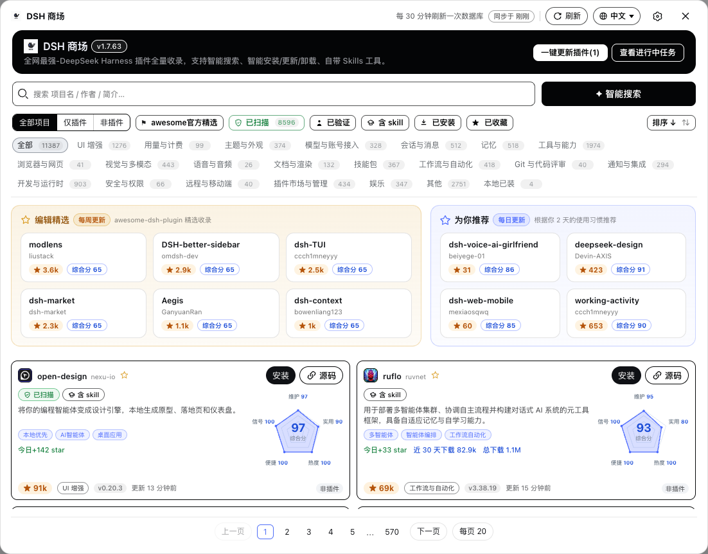
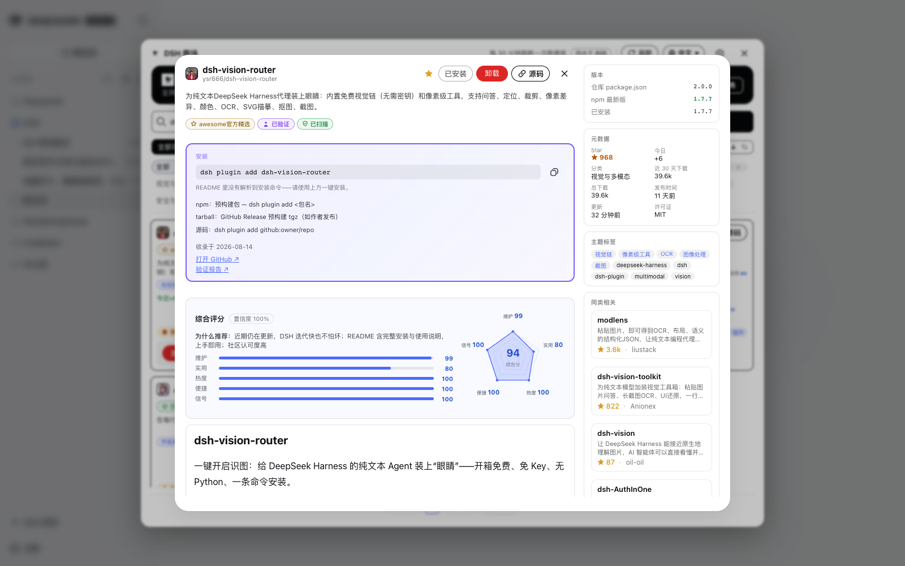
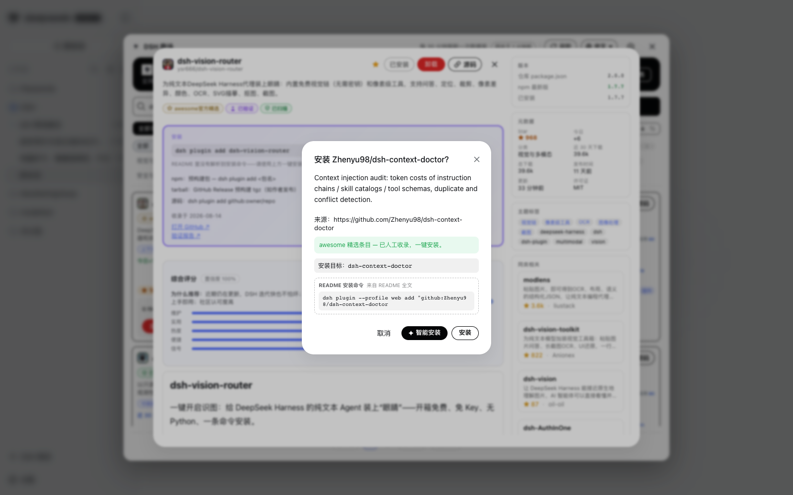
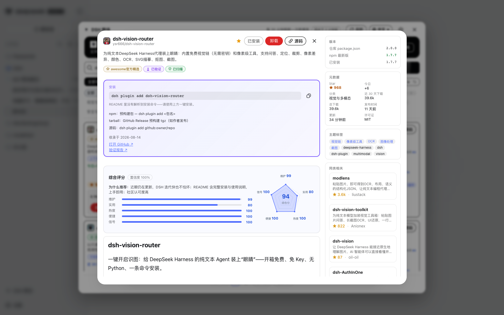

# DSH 商场

**DeepSeek Harness 最全的插件商场** —— 全量收录 `#dsh-plugin` 生态，浏览、搜索、一键安装，智能 AI 装前审查，五维实用评分，九语言界面。

[**English**](README.md) · [Releases](https://github.com/hoyyang/dsh-mall/releases) · [更新日志](CHANGELOG.md)

<p align="center">
  
  
  
  
</p>



<table>
  <tr>
    <td></td>
    <td></td>
    <td></td>
  </tr>
</table>

---

## ✨ 功能

- 🌐 **全量目录** —— 自有 CI 索引收录 `#dsh-plugin` 生态全量 GitHub 仓库（每 2 小时增量 + 每日全量重建），CDN 分发 + 打包快照兜底，永不限流。
- 🧠 **智能安装 / 更新 / 卸载** —— 装前 AI 安全审查（install / caution / refuse 三档结论）走你配置的模型；卸载前扫描本地依赖风险。AI 不可用时自动降级常规路径。
- 📊 **五维实用评分** —— 维护 / 实用 / 热度 / 便捷 / 信号，加权几何平均 × 置信度，卡片雷达图 + 「为什么推荐」理由。
- 🏷️ **LLM 打标中文标签 + 九语言简介** —— 插件自带中文功能标签与九语言一句话简介，经索引管道分发（用户零 LLM 成本）。
- 🌍 **九语言界面** —— 中文、English、日本語、한국어、Español、Français、Deutsch、Português、Русский，一键切换全店文案。
- 🛡️ **信任徽章** —— 已扫描（仓库树机器校验 dsh.bundle）、awesome 官方精选、已验证、含 skill、休眠与 npm 未回指警告。
- ⭐ **编辑精选 + 为你推荐** —— 每周更新的编辑精选；基于已装画像的推荐（MMR 多样性）+ 冷启动问卷。
- ⬇️ **关键信号** —— 今日新增 star、npm 近 30 天 / 总下载量、收录时间、版本胶囊。
- 🧰 **全生命周期管理** —— 一键更新、每日自动更新（03:30）、回退、启用开关（热生效）、带进度与取消的任务面板。
- 📖 **README 安全渲染** —— 清洗后的 Markdown（徽章/残缺标签清理），并解析 README 安装命令（仅展示、可复制）。
- 🔌 **Agent 友好** —— 自带 `find_dsh_store_plugin` 工具与 skill，对话中即可发现插件。

## 📦 安装

```sh
# GitHub 通道（始终可用）：
dsh plugin add github:hoyyang/dsh-mall
# npm 通道（发布后可用）：
dsh plugin add dsh-mall
# 或指定 profile：
dsh plugin --profile web add github:hoyyang/dsh-mall
```

重启 `dsh web`，在侧边栏「设置」上方打开 **DSH 商场**；也可以在官方设置浮窗里找到「DSH 商场设置」。

## ✅ 兼容性

- **需要 DeepSeek Harness（dsh web）0.1.0-rc.8 或更新版本** —— 已在 0.1.0-rc.8 实测。
- npm peer 依赖：`@deepseek-ai/cordis ^4.0.1`、`@deepseek-ai/dsh-settings ^0.1.0-rc.6`（可选）、`@deepseek-ai/dsh-tools ^0.1.0-rc.6` —— 经商场/插件工具安装时自动解析。
- 可选：GitHub Token（`DSHM_GITHUB_TOKEN` 或 cordis 配置 `githubToken`）提升搜索/验证/版本查询额度；token **仅存内存**，不落盘、不外发。

## 🗂 数据管道

目录由配套索引仓库 [**hoyyang/dsh-market-index**](https://github.com/hoyyang/dsh-market-index) 构建：GitHub 搜索 + 人工策展目录 [awesome-dsh-plugin](https://awesome-dsh-plugin.com)（精选条目），按策展分类归档，富化 bundle 扫描、npm 回指、休眠检测、README 结构与 LLM 标签。商场经 raw/jsDelivr CDN 通道读取，每 30 分钟刷新一次；GitHub 不可用或限流时回落到打包快照。

## 🔐 安全

- 所有写操作接口（安装/卸载/更新/开关）**仅接受同源请求**。
- 安装前始终展示来源；智能安装把仓库内容作为**不可信数据**（分隔符隔离、不执行）送入 headless AI 审查。
- GitHub Token 从不持久化；用户级数据源/Token 设置路由已删除（仅部署配置可提供）。
- 第三方插件是第三方代码——安装前请自行评估。「已扫描」徽章代表*结构可安装*，不是安全审计结论。

## 🤔 为什么又做一个市场？

市场类插件已有 40+ 家，多数同质化。DSH 商场押注 **审计 + 策展 + 趋势 + 证据**：机器扫描结论、精选策展、带解释的五维评分、LLM 标签，以及独立的数据管道。想要先看数据再安装，这里就是你的商场。

## 📄 许可证

[MIT](LICENSE) © hoyyang。数据来自 GitHub 与 [awesome-dsh-plugin](https://awesome-dsh-plugin.com)（MIT），遵循各自条款。

借鉴自 [dshmarket](https://www.npmjs.com/package/dshmarket) 与 [dsh-market](https://github.com/2BingLing/dsh-market) 的设计思路。
